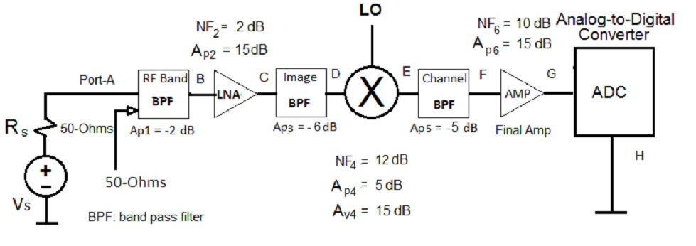

## Receiver Noise Figure

### The noise figure of a receiver is determined by the noise in the chain of circuit blocks in the signal path. Typical blocks in the chain are as follows:

- RF filter
- Low noise amplifier (LNA)
- Mixer
- Intermediate Frequency Filter (IF)
- Analog-to-Digital Converter (quantization noise)
- Coding Gain (This reduces the noise.)

---

## Noise Figure

### The noise figure of a circuit block is defined as follows:

### $$NF = \frac {SNR_{in}} {SNR_{out}}$$

### Here is the same formula in decibel units:

### $$NF (dB) = SNR_{in} (dB) - SNR_{out} (dB)$$

---

## Combined Noise Figure of Two Circuit Blocks

<html>
<head>
</head>
<body>
    <table width="900px">
        <tr>
            <td></td>
            <td>
                <p class="boxText">V<sub>s</sub>:   input signal voltage</p>
                <p class="boxText">R<sub>s</sub>:   output impedance of signal source</p>
                <p class="boxText">V<sub>in1</sub>: input voltage for first block</p>
                <p class="boxText">R<sub>in1</sub>: input impedance of first block</p>
                <p class="boxText">NF<sub>1</sub>:   Noise figure of first block</p>
                <p class="boxText">A<sub>vs1</sub>: Voltage gain of first block</p>
                <p class="boxText">A<sub>p1</sub>:  Power gain of first block</p>
                <p class="boxText">R<sub>out1</sub>:output impedance of first block</p>
            </td>
        </tr>
        <tr>
            <td>
                 <p class="boxText">  R<sub>in2</sub>: input impedance of second block</p>
                 <p class="boxText"> NF<sub>2  </sub>:   Noise figure of second block </p>
                 <p class="boxText">  A<sub>vs2</sub>: Voltage gain of second block  </p>
            </td>
            <td>
                 <p class="boxText">  A<sub>p2   </sub>: Power gain of second block</p>
                 <p class="boxText">  R<sub>out2</sub>: Output impedance of second block</p>
                 <p class="boxText">  V<sub>s2  </sub>: Output voltage for second block</p>
            </td>
        </tr>
    </table>
</body>
</html>

---

## RF Filter Block


```{r f56, echo=FALSE}
## Convert decibels to multiplier
gain_absolute_from_decibels <- function(x){
    10^(x/10)
}

nf_absolute_from_decibels <- function(x){
    10^(x/10)
}

## Combined Noise Factor
get_combined_nf <- function(nf1, nf2, ap1){
    nf1 + (nf2 - 1) / ap1
}

## Channel filter with loss L = 3 dB A_p5  =???10???^((-Loss)/10)=???10???^((-3 dB)/10)=0.50119???0.5

ap_filter_db = -3 ## Bandpass filter

ap1_db <- -2 ## Bandpass filter
ap2_db <- 15
ap3_db <- -6 ## Bandpass filter
ap4_db <-  5
ap5_db <- -3 ## Bandpass filter
ap6_db <- 9

ap_filter_db = gain_absolute_from_decibels(ap_filter_db)

ap1 = gain_absolute_from_decibels(ap1_db)
ap2 = gain_absolute_from_decibels(ap2_db)
ap3 = gain_absolute_from_decibels(ap3_db)
ap4 = gain_absolute_from_decibels(ap4_db)
ap5 = gain_absolute_from_decibels(ap5_db)
ap6 = gain_absolute_from_decibels(ap6_db)

```

#### The noise figure of a passive block such as a filter or RF switch is the reciprocal of the loss which the manufacturer might specify in decibels. A loss in decibels is equal to the negative gain of the same block; if Loss = 3 dB then Gain = + 3 dB. We convert the loss from decibels to an ordinary multiplier as follows:

##### $$A_{filter} = 10 ^ {\frac {-Loss}{10}}$$

##### $$NF_{filter} = 1 / A_{filter}$$

##### $$NF_{dB} = 10 * log_{10}(NF_{filter})$$


#### We calculate the noise figure of a filter with a loss of 3 dB: 

```{r filterexample, echo=FALSE}

print(as.numeric(formatC(ap_filter_db, format = "f", digits = 3)))

```

---

## Example Problem

#### What is the cummulative noise figure (NF) for the chain from Port A to Port G? 

<html>
<head>
</head>
<body>
    
</body>
</html>


#### To determine the noise figure for a chain of three or more blocks, the procedure for two blocks is repeated in an iterative manner beginning with the final two blocks in the chain and adding blocks one at a time in reverse order. We generally state the noise figure as an ordinary multiplier but we show the result in decibels at the end also.  

--- 

### Combine blocks 5 and 6 between Port E and Port G

###### Block 5 is a passive filter. Block 6 is an amplifier after the IF filters.  

##### $$NF_{5-6} = NF_5 + \frac {NF_6 - 1}  {Ap_5}$$

```{r stages56a, echo=FALSE}

ap5_db <- -5 ## -5 ## Bandpass filter
ap5 <- gain_absolute_from_decibels(ap5_db)
nf5 <- 1/ap5

nf6_db <- 10 ## 15
nf6 <- nf_absolute_from_decibels(nf6_db)

```


```{r stages56b, echo=TRUE}

nf_56 <- get_combined_nf(nf5, nf6, ap5)
print(as.numeric(formatC(nf_56, format = "f", digits = 3)))

```

###### This is the noise figure expressed as a multiplier factor. This could be expressed alternatively in decibels as we do later at the final combination.


---

### Combine Mixer Block-4 the result for 5 and 6:  Port D to Port G

This is a reproducible slide show made with R-tools. Some calculations are hidden to keep the presentation understandable, but everything is available in an on-line Github repository.


```{r stages4a, echo=FALSE}

ap4_db <- 5
ap4 <- gain_absolute_from_decibels(ap4_db)
nf4_db <- 12 ## This is given (the manufacturer or the equivalent)
nf4 <- nf_absolute_from_decibels(nf4_db)


```

```{r stages4b, echo=TRUE}

nf_456 <- get_combined_nf(nf4, nf_56, ap4)
print(as.numeric(formatC(nf_456, format = "f", digits = 3)))

```

---

### Combine filter in Block-3 the result for 4,5,6:  Port C to Port G

```{r stages3a, echo=TRUE}

ap3_db <- -6 ## dB
ap3 <- gain_absolute_from_decibels(ap3_db)
nf3 <- 1/ap3 ## filter formula

nf_3456 <- get_combined_nf(nf3, nf_456, ap3)
print(as.numeric(formatC(nf_3456, format = "f", digits = 3)))

```

---

### Combine LNA in Block-2 with the result for Blocks 3-6:  Port B to Port G

```{r stages2a, echo=FALSE}

av2_db <- 15
av2 <- gain_absolute_from_decibels(av2_db)

```

```{r stages2b, echo=TRUE}

ap2 <- av2
nf2_db <- 2 ## This is given (the manufacturer or the equivalent)
nf2 <- nf_absolute_from_decibels(nf2_db)
nf_23456 <- get_combined_nf(nf2, nf_3456, ap2)
print(as.numeric(formatC(nf_23456, format = "f", digits = 3)))

## Convert Noise Figure to decibels
nf23456_db <- 10 * log10(nf_23456)
print(as.numeric(formatC(nf23456_db, format = "f", digits = 3)))

```

---

### Combine filter in Block-1 with the results for Blocks 5-6;  Port A to Port G

```{r stages1a, echo=FALSE}

ap1_db <- -2 ## dB
ap1 <- gain_absolute_from_decibels(ap1_db)
nf1 <- 1/ap1 ## filter formula

nf_123456 <- get_combined_nf(nf1, nf_23456, ap1)
nf_db <- 10 * log10(nf_123456)

```

###### We repeat the procedure when we added the filter in Block-3 but the effect of the input filter is the same as just adding its loss in decibels to the Noise Figure. The combined result up to the analog-to-digital converter is:  

```{r stages1b, echo=TRUE}
## Noise factor multiplier
print(as.numeric(formatC(nf_123456, format = "f", digits = 3)))
## Noise factor in decibels
print(as.numeric(formatC(nf_db, format = "f", digits = 3)))

```

The effect of the RF filter in the first block in the chain degrades the noise factor by the same factor as the filter loss.

---

## Analog-to-Digital Converter Block

#### The quantization process of assigning the available discrete levels to each sampled signal level adds noise to the signal for two reasons. The first reason is the distance between the analog signal level and the closest discrete level. The second reason corresponds to linearity errors which occur when sample measurements are not assigned to the closed discrete level. Most linearity errors are caused by voltage reference inaccuracy. For example, it the voltage reference had a tolerance of 1% and there were 256 discrete levels, the reference is clearly not accurate enough to reliably assign sample measurements to the closest level. The easiest way to calculate the noise factor of a converter block is if the manufacturer specifies the signal-to-noise ratio (SNR) at the converter output.

### $$NF (dB) = Power_{in} (dB) - SNR_{ADC} - Noise_{in} (dB)$$

#### Contributions to the overall noise figure decreases as the signal moves along the chain except for the digital-to-analog converter at the end.

---

<br><br>

#### The example problem is similar to the example on page 202 of the Razavi textbook except for rounding effects. All results are expressed after rounding to a few decimal places.

<br><br>

#### Derivations of the formulas listed in this slide show are available. A future slide show will examine how the modify the chain in order to effectively incorporate the analog-to-digital converter.

<br></br>

July 18, 2017

--- #custsty

<style>
#custsty {
  /*background-image:url(C:/path/mypng.png);*/ 
  background-repeat: no-repeat;
  background-position: center center;
  background-size: cover;
}

.boxText {
     font-size:0.9em;

}
    
table{
    border-collapse: collapse;
    width: 960px;
    height: 200px;
    background-color: #9999FF;
    background-image: none;
    cell-spacing: 0px;
    padding-left: 0px;
    padding-right: 0px;
    padding-top: 0px;
    padding-bottom: 0px;
    border: 0px solid #BBBBFF;
    text-font: 12px;
}
th, td {
    padding-left: 0px;
    padding-right: 0px;
    padding-top: 0px;
    padding-bottom: 0px;
    background-color: #DDEEEE;
    cell-spacing: 0px;
    border: 0px solid #FFFFFF;
    margin: 0px;
    width: 480px;
    height: 200
}
p {
    padding-left:10px;
    font-family: arial, verdana, sans-serif;
    font-size:14px;
}
img {
    padding-left: 0px;
    padding-right: 0px;
    padding-top: 0px;
    padding-bottom: 0px;
    border: 0px solid #FFFFFF;
    margin: 0px;
    width: 500px;
}

.img {
    padding-left: 0px;
    padding-right: 0px;
    padding-top: 0px;
    padding-bottom: 0px;
    border: 0px solid #FFFFFF;
    margin: 0px;
    width: 750px;
    margin-left: auto;
    margin-right: auto;
}

caption{
    padding-bottom: 8px;
    font-size: 0.5em;
}
sub, sup {
 font-size: 75%;
 line-height: 0;
 position: relative;
 vertical-align: baseline;

}
</style>
    